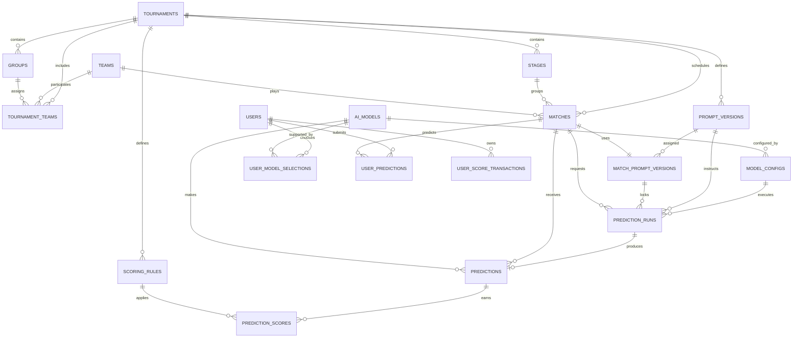

# 数据库设计

## 1. 设计结论

原始的六类表方向正确，但不够完整：

1. “球队”和“比赛”无法表达赛事届次、阶段、小组及球队在某届赛事中的状态。
2. “大模型”无法表达同一品牌下的多个模型版本、Prompt 版本和运行参数。
3. “预测”需要区分 API 调用记录、原始响应和最终发布的结构化预测。
4. “得分”需要拆分计分规则与得分明细，否则规则调整后无法审计历史结果。
5. 用户站队、竞猜和积分排行需要独立的关系表与积分流水。
6. 比赛爬取、模型调用和计分都需要幂等标识，避免任务重跑时重复写入。

数据库使用 MySQL 8.0。最初方案包含 15 张 AI 预测核心表；当前 MVP 已额外实现
`job_runs`、`user_profiles` 和 `user_match_predictions`。实际结构始终以
`backend/migrations/` 为准。

## 2. 通用约定

除特殊说明外，所有业务表包含：

| 字段 | 类型 | 说明 |
| -- | -- | -- |
| id | bigint unsigned | 主键，默认 `AUTO_INCREMENT` |
| created_at | datetime(3) | 创建时间，默认 `CURRENT_TIMESTAMP(3)` |
| updated_at | datetime(3) | 最后更新时间，默认 `CURRENT_TIMESTAMP(3) ON UPDATE CURRENT_TIMESTAMP(3)` |

其他约定：

- 数据库连接和应用服务统一设置 `time_zone = '+00:00'`，所有 `datetime(3)` 按 UTC 写入，前端按用户时区展示。
- 金额、概率和积分不要使用 `FLOAT` 或 `DOUBLE`，使用 `DECIMAL`。
- 状态字段使用 `varchar` 配合 `CHECK`。MySQL 8.0.16 及以后才真正执行 `CHECK`，应用层仍需同步校验。
- 布尔值使用 `tinyint(1)`，并用 `0/1` 表示 false/true。
- 表引擎统一使用 `InnoDB`，字符集使用 `utf8mb4`，排序规则建议 `utf8mb4_0900_ai_ci`。
- 外键字段的数据类型、是否 unsigned 必须与被引用主键完全一致。
- 核心历史数据不做物理删除；使用状态字段或 `deleted_at` 软删除。
- 发布后的预测、模型配置和原始响应不可直接覆盖。

推荐建表默认项：

```sql
ENGINE=InnoDB
DEFAULT CHARSET=utf8mb4
COLLATE=utf8mb4_0900_ai_ci
```

> MySQL 的 `TIMESTAMP` 受会话时区和 2038 年范围影响。本项目使用 `DATETIME(3)`，并由应用保证 UTC。

## 3. 核心比赛数据

### 3.1 tournaments（赛事届次）

支持 2026 世界杯及未来赛事，避免把年份和规则写死。

| 字段 | 类型 | 约束/说明 |
| -- | -- | -- |
| id | bigint unsigned | 主键 |
| name | varchar(100) | 如 `FIFA World Cup` |
| edition | varchar(50) | 如 `2026` |
| slug | varchar(100) | 唯一，如 `world-cup-2026` |
| host_countries | json | 举办国代码数组 |
| starts_at | date | 开始日期 |
| ends_at | date | 结束日期 |
| team_count | smallint | 参赛球队数 |
| match_count | smallint | 总场次数 |
| status | varchar(20) | `draft/upcoming/active/completed` |
| rules | json | 该届赛事规则快照 |

索引与约束：

- `UNIQUE(slug)`
- 索引：`status`

### 3.2 stages（比赛阶段）

| 字段 | 类型 | 约束/说明 |
| -- | -- | -- |
| id | bigint unsigned | 主键 |
| tournament_id | bigint unsigned | 外键 -> tournaments.id |
| name | varchar(50) | 如 `Group Stage`、`Round of 32`、`Final` |
| code | varchar(30) | 阶段代码 |
| stage_type | varchar(20) | `group/knockout` |
| sequence | smallint | 阶段顺序 |
| starts_at | datetime(3) | 开始时间，可空 |
| ends_at | datetime(3) | 结束时间，可空 |
| status | varchar(20) | `upcoming/active/completed` |

索引与约束：

- `UNIQUE(tournament_id, code)`
- `UNIQUE(tournament_id, sequence)`

### 3.3 groups（小组）

| 字段 | 类型 | 约束/说明 |
| -- | -- | -- |
| id | bigint unsigned | 主键 |
| tournament_id | bigint unsigned | 外键 -> tournaments.id |
| stage_id | bigint unsigned | 外键 -> stages.id |
| name | varchar(30) | 如 `Group A` |
| code | varchar(10) | 如 `A` |
| sequence | smallint | 展示顺序 |

约束：

- `UNIQUE(tournament_id, code)`

### 3.4 teams（球队）

本表只保存球队长期基础信息，不保存某届世界杯的小组和最终名次。

| 字段 | 类型 | 约束/说明 |
| -- | -- | -- |
| id | bigint unsigned | 主键 |
| name | varchar(100) | 英文名称 |
| short_name | varchar(50) | 短名称 |
| code | char(3) | FIFA 三字码，唯一 |
| country_code | char(2) | ISO 国家或地区代码 |
| confederation | varchar(20) | `AFC/CAF/UEFA/CONMEBOL/CONCACAF/OFC` |
| flag_url | text | 国旗图片地址 |
| logo_url | text | 队徽地址，可空 |
| fifa_ranking | smallint | 当前 FIFA 排名，可空 |
| elo_rating | decimal(8,2) | 当前 Elo 分，可空 |
| coach_name | varchar(100) | 当前主教练，可空 |
| metadata | json | 其他扩展资料 |

索引与约束：

- `UNIQUE(code)`
- 索引：`confederation`

> 如果需要保存球员、教练和排名的历史变化，应继续拆分 `players`、`team_squads`、`coaches` 和 `team_rating_snapshots`，不要只依赖本表当前值。

### 3.5 tournament_teams（赛事参赛球队）

连接球队与某届赛事，记录分组和该届赛事结果。

| 字段 | 类型 | 约束/说明 |
| -- | -- | -- |
| id | bigint unsigned | 主键 |
| tournament_id | bigint unsigned | 外键 -> tournaments.id |
| team_id | bigint unsigned | 外键 -> teams.id |
| group_id | bigint unsigned | 外键 -> groups.id，可空 |
| pot_number | smallint | 抽签档位，可空 |
| qualification_method | varchar(100) | 晋级方式，可空 |
| is_host | tinyint(1) | 是否东道主，默认 false |
| final_position | smallint | 最终名次，可空 |
| eliminated_stage_id | bigint unsigned | 外键 -> stages.id，可空 |
| status | varchar(20) | `qualified/active/eliminated/withdrawn` |

索引与约束：

- `UNIQUE(tournament_id, team_id)`
- 索引：`group_id`、`status`

### 3.6 matches（比赛）

| 字段 | 类型 | 约束/说明 |
| -- | -- | -- |
| id | bigint unsigned | 主键 |
| tournament_id | bigint unsigned | 外键 -> tournaments.id |
| stage_id | bigint unsigned | 外键 -> stages.id |
| group_id | bigint unsigned | 外键 -> groups.id，淘汰赛可空 |
| external_id | varchar(100) | FIFA 或数据供应商的比赛 ID |
| match_number | smallint | 本届赛事场次编号 |
| home_team_id | bigint unsigned | 外键 -> teams.id，未确定时可空 |
| away_team_id | bigint unsigned | 外键 -> teams.id，未确定时可空 |
| home_placeholder | varchar(100) | 如 `Winner Match 73` |
| away_placeholder | varchar(100) | 如 `Runner-up Group A` |
| venue_name | varchar(150) | 球场名称 |
| host_city | varchar(100) | 举办城市 |
| scheduled_at | datetime(3) | 计划开球时间 |
| status | varchar(20) | `scheduled/live/finished/postponed/cancelled` |
| home_score_90 | smallint | 90 分钟含补时结束时的主队得分 |
| away_score_90 | smallint | 90 分钟含补时结束时的客队得分 |
| home_score_after_extra_time | smallint | 加时赛结束后的主队得分，未加时则可空 |
| away_score_after_extra_time | smallint | 加时赛结束后的客队得分，未加时则可空 |
| home_penalty_score | smallint | 点球大战得分，可空 |
| away_penalty_score | smallint | 点球大战得分，可空 |
| winner_team_id | bigint unsigned | 外键 -> teams.id，可空 |
| result_type | varchar(20) | `regular_time/extra_time/penalties` |
| started_at | datetime(3) | 实际开始时间，可空 |
| finished_at | datetime(3) | 实际结束时间，可空 |
| source_updated_at | datetime(3) | 外部数据更新时间 |

索引与约束：

- `UNIQUE(tournament_id, match_number)`
- `UNIQUE(external_id)`，允许空值
- `CHECK(home_team_id IS NULL OR home_team_id <> away_team_id)`
- 索引：`scheduled_at`、`status`、`stage_id`、`home_team_id`、`away_team_id`

小组积分榜第一版可根据比赛结果实时计算。查询压力增大后，再增加 `group_standings_snapshots` 快照表。

## 4. AI 模型与预测

### 4.1 ai_models（AI 模型）

一条记录代表一个独立参赛的具体模型版本，而不是只记录厂商品牌。

| 字段 | 类型 | 约束/说明 |
| -- | -- | -- |
| id | bigint unsigned | 主键 |
| provider | varchar(50) | 原始模型厂商，如 `OpenAI/Anthropic/Google` |
| name | varchar(100) | 网站展示名 |
| model_key | varchar(150) | OpenRouter 使用的具体模型标识 |
| gateway | varchar(30) | 调用网关，当前固定为 `openrouter` |
| version | varchar(100) | 模型版本或发布日期 |
| slug | varchar(120) | 网站唯一标识 |
| description | text | 模型介绍 |
| avatar_url | text | 模型头像 |
| personality | varchar(100) | 如 `Hardcore Analyst` |
| is_reasoning_enabled | tinyint(1) | 是否开启推理 |
| reasoning_effort | varchar(20) | `low/medium/high`，可空 |
| is_active | tinyint(1) | 是否参与当前活动 |
| retired_at | datetime(3) | 停用时间，可空 |
| metadata | json | 供应商特有信息 |

约束：

- `UNIQUE(slug)`
- `UNIQUE(provider, model_key, version)`

### 4.2 model_configs（模型调用配置）

保存各模型特有的调用参数。已发布配置不修改，变更时创建下一版本。Prompt 使用独立版本表管理，避免各模型使用不同任务描述。

| 字段 | 类型 | 约束/说明 |
| -- | -- | -- |
| id | bigint unsigned | 主键 |
| ai_model_id | bigint unsigned | 外键 -> ai_models.id |
| tournament_id | bigint unsigned | 外键 -> tournaments.id |
| version | int | 配置版本，从 1 开始 |
| temperature | decimal(4,3) | 温度，可空 |
| top_p | decimal(4,3) | Top P，可空 |
| max_output_tokens | int | 最大输出 Token，可空 |
| seed | int | 随机种子，可空 |
| config | json | 供应商特有参数 |
| is_active | tinyint(1) | 是否为当前配置 |
| published_at | datetime(3) | 发布时间 |

索引与约束：

- `UNIQUE(ai_model_id, tournament_id, version)`
- MySQL 不支持部分唯一索引。增加生成列：
  `active_unique_key bigint unsigned GENERATED ALWAYS AS (IF(is_active = 1, tournament_id, NULL)) STORED`
- 建唯一索引 `UNIQUE(ai_model_id, active_unique_key)`。MySQL 唯一索引允许多个 `NULL`，因此历史非活动配置不冲突

### 4.3 prompt_versions（Prompt 版本）

保存不可变的正式 Prompt 版本。任何内容变化，包括标点、规则、输出字段和 JSON Schema，都应创建新版本。

| 字段 | 类型 | 约束/说明 |
| -- | -- | -- |
| id | bigint unsigned | 主键 |
| tournament_id | bigint unsigned | 外键 -> tournaments.id |
| prompt_type | varchar(30) | `match/tournament_podium` |
| name | varchar(100) | 如 `Match Prediction V1` |
| version | int | 同一类型下的递增版本号 |
| version_key | varchar(100) | 唯一标识，如 `match-prediction-v1` |
| system_prompt | text | 完整 System Prompt |
| user_prompt_template | text | User Prompt 模板 |
| output_json_schema | json | OpenRouter Structured Outputs 使用的 JSON Schema |
| schema_version | varchar(30) | 输出结构版本 |
| change_summary | text | 相比上一版本的变更说明 |
| change_reason | text | 修改原因和预期效果 |
| content_hash | char(64) | System、User 模板和 Schema 的 SHA-256 |
| status | varchar(20) | `draft/published/retired` |
| published_at | datetime(3) | 发布时间，可空 |
| retired_at | datetime(3) | 停用时间，可空 |

索引与约束：

- `UNIQUE(tournament_id, prompt_type, version)`
- `UNIQUE(version_key)`
- `UNIQUE(tournament_id, prompt_type, content_hash)`
- `status = 'published'` 后禁止更新 Prompt 内容，只能将状态改为 `retired`

### 4.4 match_prompt_versions（比赛 Prompt 绑定）

显式记录每场比赛使用哪个 Prompt 版本。不能只依赖“当前活动版本”，否则以后无法准确复现历史预测。

| 字段 | 类型 | 约束/说明 |
| -- | -- | -- |
| id | bigint unsigned | 主键 |
| match_id | bigint unsigned | 外键 -> matches.id |
| prompt_version_id | bigint unsigned | 外键 -> prompt_versions.id |
| assignment_version | int | 该比赛绑定版本，从 1 开始 |
| data_snapshot_hash | char(64) | 该场统一输入数据快照的 SHA-256 |
| data_cutoff_at | datetime(3) | 本场预测允许使用的数据截止时间 |
| assigned_at | datetime(3) | 绑定时间 |
| locked_at | datetime(3) | 锁定时间；锁定后不可更换版本 |
| status | varchar(20) | `assigned/locked/voided/superseded` |
| is_current | tinyint(1) | 是否为当前有效绑定 |

索引与约束：

- `UNIQUE(match_id, assignment_version)`
- 增加生成列：
  `current_match_id bigint unsigned GENERATED ALWAYS AS (IF(is_current = 1, match_id, NULL)) STORED`
- 建唯一索引 `UNIQUE(current_match_id)`，保证一场比赛最多只有一个当前绑定，同时允许保留历史绑定
- 被绑定的 `prompt_versions.prompt_type` 必须为 `match`
- 开始任何正式模型调用前必须设置 `locked_at`
- 同一场比赛的所有模型调用必须引用该绑定记录
- 已产生正式模型调用的绑定不能被普通替换；只有比赛延期、数据错误等明确作废场景才能保留旧记录并创建下一绑定版本

> 例如比赛 1 至 4 分别绑定 V1，比赛 5 以后绑定 V2。V2 发布后不会改变前四场的绑定，也不得使用 V2 重跑前四场正式预测。

### 4.5 prediction_runs（预测调用记录）

记录每次 API 请求，包括失败与重试，用于成本、故障和结果追踪。

| 字段 | 类型 | 约束/说明 |
| -- | -- | -- |
| id | bigint unsigned | 主键 |
| model_config_id | bigint unsigned | 外键 -> model_configs.id |
| prompt_version_id | bigint unsigned | 外键 -> prompt_versions.id |
| match_prompt_version_id | bigint unsigned | 外键 -> match_prompt_versions.id，天眼预测可空 |
| match_id | bigint unsigned | 外键 -> matches.id，天眼预测可空 |
| prediction_type | varchar(30) | `match/tournament_podium` |
| idempotency_key | varchar(150) | 任务幂等键，唯一 |
| gateway | varchar(30) | 调用网关，当前为 `openrouter` |
| gateway_request_id | varchar(150) | OpenRouter 返回的请求或生成记录 ID，可空 |
| requested_model_key | varchar(150) | 请求时使用的 OpenRouter 模型标识 |
| resolved_model_key | varchar(150) | 实际完成调用的模型标识，可空 |
| rendered_system_prompt | longtext | 本次调用实际发送的完整 System Prompt |
| rendered_user_prompt | longtext | 本次调用实际发送的完整 User Prompt |
| data_snapshot_hash | char(64) | 本次使用的数据快照 SHA-256 |
| request_payload | json | 实际发送的请求 |
| reasoning_config | json | 本次实际使用的推理配置，可空 |
| raw_response | json | 模型原始响应，可空 |
| status | varchar(20) | `pending/running/succeeded/failed` |
| attempt_number | smallint | 第几次尝试 |
| input_tokens | int | 输入 Token 数，可空 |
| output_tokens | int | 输出 Token 数，可空 |
| reasoning_tokens | int | 输出 Token 中的推理 Token 数，可空 |
| total_tokens | int | 输入与输出 Token 总数，可空 |
| cost_amount | decimal(12,6) | 调用成本，可空 |
| cost_currency | char(3) | 如 `USD` |
| latency_ms | int | 响应耗时，可空 |
| error_code | varchar(100) | 错误码，可空 |
| error_message | text | 错误信息，可空 |
| started_at | datetime(3) | 调用开始时间 |
| finished_at | datetime(3) | 调用结束时间，可空 |

索引与约束：

- `UNIQUE(idempotency_key)`
- `gateway_request_id` 在非空时应唯一
- 单场预测的 `prompt_version_id` 必须与 `match_prompt_versions.prompt_version_id` 一致
- 索引：`model_config_id`、`prompt_version_id`、`match_id`、`status`

OpenRouter API Key 不进入数据库。应用通过环境变量 `OPENROUTER_API_KEY` 读取，并在日志、异常信息和请求快照中进行脱敏。

### 4.6 predictions（单场比赛正式预测）

一条记录代表一个模型对一场比赛最终发布并参与计分的预测。

| 字段 | 类型 | 约束/说明 |
| -- | -- | -- |
| id | bigint unsigned | 主键 |
| tournament_id | bigint unsigned | 外键 -> tournaments.id |
| match_id | bigint unsigned | 外键 -> matches.id |
| ai_model_id | bigint unsigned | 外键 -> ai_models.id |
| model_config_id | bigint unsigned | 外键 -> model_configs.id |
| prediction_run_id | bigint unsigned | 外键 -> prediction_runs.id |
| predicted_result | varchar(10) | 预测 90 分钟结果：`home/draw/away` |
| predicted_home_score | smallint | 预测 90 分钟主队比分 |
| predicted_away_score | smallint | 预测 90 分钟客队比分 |
| predicted_goal_diff | smallint | 预测 90 分钟主队净胜球 |
| predicted_winner_team_id | bigint unsigned | 淘汰赛最终晋级或获胜球队，可空 |
| predicted_decision_method | varchar(20) | 淘汰赛决胜方式：`regular_time/extra_time/penalties`，可空 |
| home_win_probability | decimal(5,4) | 0 至 1 |
| draw_probability | decimal(5,4) | 0 至 1 |
| away_win_probability | decimal(5,4) | 0 至 1 |
| confidence | decimal(5,4) | 模型自评信心，可空 |
| reasoning | text | 完整预测理由 |
| highlight_quote | text | 用于“神评论”的摘要 |
| predicted_at | datetime(3) | 预测时间 |
| locked_at | datetime(3) | 锁定时间 |
| status | varchar(20) | `draft/published/voided` |

索引与约束：

- `UNIQUE(match_id, ai_model_id)`，每个模型每场比赛只有一个正式预测
- 概率字段均在 0 至 1 之间，三项之和允许小量舍入误差
- `CHECK(predicted_home_score >= 0 AND predicted_away_score >= 0)`
- 小组赛的 `predicted_winner_team_id` 和 `predicted_decision_method` 应为空
- 淘汰赛必须填写 `predicted_winner_team_id` 和 `predicted_decision_method`
- `predicted_winner_team_id` 必须是该场比赛的主队或客队
- 索引：`ai_model_id`、`match_id`、`predicted_at`

如果允许开赛前修改预测，应增加 `prediction_revisions` 保存历史版本，不能覆盖旧内容。

### 4.7 tournament_predictions（天眼预测）

用于小组赛结束后预测最终前三名。

| 字段 | 类型 | 约束/说明 |
| -- | -- | -- |
| id | bigint unsigned | 主键 |
| tournament_id | bigint unsigned | 外键 -> tournaments.id |
| ai_model_id | bigint unsigned | 外键 -> ai_models.id |
| model_config_id | bigint unsigned | 外键 -> model_configs.id |
| prediction_run_id | bigint unsigned | 外键 -> prediction_runs.id |
| prompt_version_id | bigint unsigned | 外键 -> prompt_versions.id |
| champion_team_id | bigint unsigned | 外键 -> teams.id |
| runner_up_team_id | bigint unsigned | 外键 -> teams.id |
| third_place_team_id | bigint unsigned | 外键 -> teams.id |
| reasoning | text | 预测理由 |
| highlight_quote | text | 展示摘要 |
| predicted_at | datetime(3) | 预测时间 |
| locked_at | datetime(3) | 锁定时间 |
| status | varchar(20) | `draft/published/voided` |

约束：

- `UNIQUE(tournament_id, ai_model_id)`
- 冠军、亚军和季军球队必须互不相同

### 4.8 scoring_rules（计分规则）

不要把 `+1/+2/+3` 写死在代码中，以便活动审计和以后调整。

| 字段 | 类型 | 约束/说明 |
| -- | -- | -- |
| id | bigint unsigned | 主键 |
| tournament_id | bigint unsigned | 外键 -> tournaments.id |
| code | varchar(50) | `RESULT/GOAL_DIFF/EXACT_SCORE/ADVANCING_TEAM/EXTRA_TIME/PENALTIES/CHAMPION/RUNNER_UP/THIRD_PLACE/PODIUM_WRONG_POSITION` |
| name | varchar(100) | 规则名称 |
| prediction_type | varchar(30) | `match/tournament_podium` |
| points | decimal(8,2) | 命中分数 |
| priority | smallint | 计算顺序 |
| is_stackable | tinyint(1) | 是否可与其他规则叠加 |
| conditions | json | 可配置判断条件 |
| effective_from | datetime(3) | 生效时间 |
| effective_to | datetime(3) | 失效时间，可空 |
| is_active | tinyint(1) | 是否启用 |

约束：

- `UNIQUE(tournament_id, code, effective_from)`

最终规则采用累计计分，所有规则的 `is_stackable` 均设为 1：

| code | 分值 | 说明 |
| -- | --: | -- |
| RESULT | 2 | 90 分钟胜负平正确 |
| GOAL_DIFF | 1 | 90 分钟净胜球正确 |
| EXACT_SCORE | 2 | 90 分钟准确比分正确 |
| ADVANCING_TEAM | 2 | 淘汰赛最终晋级或获胜球队正确 |
| EXTRA_TIME | 1 | 正确预测进入加时赛 |
| PENALTIES | 1 | 正确预测进入点球大战 |
| CHAMPION | 30 | 冠军球队及位置正确 |
| RUNNER_UP | 20 | 亚军球队及位置正确 |
| THIRD_PLACE | 10 | 季军球队及位置正确 |
| PODIUM_WRONG_POSITION | 5 | 球队进入前三但预测位置错误 |

当 `predicted_decision_method = 'penalties'` 时，表示同时预测进入加时赛和点球大战，因此两项命中后均可得分。同一支前三名球队只应用一个最高分规则。

### 4.9 prediction_scores（预测得分明细）

一条预测可产生多条得分明细，排行榜从明细聚合得到。

| 字段 | 类型 | 约束/说明 |
| -- | -- | -- |
| id | bigint unsigned | 主键 |
| prediction_id | bigint unsigned | 外键 -> predictions.id，可空 |
| tournament_prediction_id | bigint unsigned | 外键 -> tournament_predictions.id，可空 |
| scoring_rule_id | bigint unsigned | 外键 -> scoring_rules.id |
| ai_model_id | bigint unsigned | 外键 -> ai_models.id |
| match_id | bigint unsigned | 外键 -> matches.id，可空 |
| points | decimal(8,2) | 本项实际得分 |
| is_hit | tinyint(1) | 是否命中 |
| calculation_detail | json | 预测值、实际值和判断过程 |
| idempotency_key | varchar(150) | 防止重复计分，唯一 |
| calculated_at | datetime(3) | 计算时间 |
| calculation_version | int | 计分程序版本 |

索引与约束：

- `CHECK((prediction_id IS NOT NULL) <> (tournament_prediction_id IS NOT NULL))`
- `UNIQUE(idempotency_key)`
- `UNIQUE(prediction_id, scoring_rule_id)`
- `UNIQUE(tournament_prediction_id, scoring_rule_id)`
- 索引：`ai_model_id`、`match_id`、`calculated_at`

排行榜第一版直接聚合本表。数据量或访问量增加后，可增加 `model_leaderboard_snapshots`，缓存每轮总分、准确率、排名、连胜和趣味标签。

## 5. 用户互动数据

本节的四表结构是面向正式账号体系的完整目标设计。当前 MVP 为了支持匿名活动测试，
采用了更轻量的两表实现：

### 当前 MVP：user_profiles

| 字段 | 类型 | 约束/说明 |
| -- | -- | -- |
| id | bigint unsigned | 主键 |
| public_id | char(36) | 浏览器生成的 UUID，唯一 |
| display_name | varchar(40) | 展示名称 |
| trusted_model_id | bigint unsigned | 外键 -> ai_models.id，可空 |

### 当前 MVP：user_match_predictions

| 字段 | 类型 | 约束/说明 |
| -- | -- | -- |
| id | bigint unsigned | 主键 |
| user_id | bigint unsigned | 外键 -> user_profiles.id |
| match_id | bigint unsigned | 外键 -> matches.id |
| predicted_home_score | smallint unsigned | 预测主队 90 分钟比分 |
| predicted_away_score | smallint unsigned | 预测客队 90 分钟比分 |
| points | decimal(8,2) | 当前得分 |
| submitted_at | datetime(3) | 提交时间 |
| scored_at | datetime(3) | 计分时间，可空 |

约束：

- `UNIQUE(user_id, match_id)`
- 用户只能在比赛开始前提交或更新预测

以下 `users`、`user_model_selections`、`user_predictions` 和
`user_score_transactions` 是正式账号、跨设备身份和积分流水上线时的升级方案，当前
迁移尚未采用。

### 5.1 users（用户）

| 字段 | 类型 | 约束/说明 |
| -- | -- | -- |
| id | bigint unsigned | 主键 |
| email | varchar(255) | 邮箱，可空且唯一 |
| username | varchar(50) | 用户名，唯一 |
| display_name | varchar(100) | 展示名称 |
| avatar_url | text | 头像地址 |
| auth_provider | varchar(30) | `email/google/github/wechat/guest` |
| provider_user_id | varchar(255) | 第三方用户 ID，可空 |
| status | varchar(20) | `active/banned/deleted` |
| last_login_at | datetime(3) | 最后登录时间 |

约束：

- `UNIQUE(username)`
- `UNIQUE(auth_provider, provider_user_id)`

### 5.2 user_model_selections（用户选择 AI 军师）

| 字段 | 类型 | 约束/说明 |
| -- | -- | -- |
| id | bigint unsigned | 主键 |
| user_id | bigint unsigned | 外键 -> users.id |
| tournament_id | bigint unsigned | 外键 -> tournaments.id |
| ai_model_id | bigint unsigned | 外键 -> ai_models.id |
| selected_at | datetime(3) | 选择时间 |
| locked_at | datetime(3) | 锁定时间，可空 |
| status | varchar(20) | `active/changed/expired` |

约束：

- MySQL 不支持部分唯一索引。增加生成列：
  `active_tournament_id bigint unsigned GENERATED ALWAYS AS (IF(status = 'active', tournament_id, NULL)) STORED`
- 建唯一索引 `UNIQUE(user_id, active_tournament_id)`，保证同一用户在同一赛事只有一个活动军师
- 索引：`ai_model_id`

### 5.3 user_predictions（用户竞猜）

| 字段 | 类型 | 约束/说明 |
| -- | -- | -- |
| id | bigint unsigned | 主键 |
| user_id | bigint unsigned | 外键 -> users.id |
| tournament_id | bigint unsigned | 外键 -> tournaments.id |
| match_id | bigint unsigned | 外键 -> matches.id |
| ai_model_id | bigint unsigned | 竞猜时跟随的 AI，可空 |
| predicted_result | varchar(10) | `home/draw/away` |
| predicted_home_score | smallint | 预测主队比分 |
| predicted_away_score | smallint | 预测客队比分 |
| virtual_stake | int | 虚拟下注积分，默认 0 |
| submitted_at | datetime(3) | 提交时间 |
| locked_at | datetime(3) | 锁定时间 |
| status | varchar(20) | `active/scored/voided` |

索引与约束：

- `UNIQUE(user_id, match_id)`
- `CHECK(virtual_stake >= 0)`
- 索引：`match_id`、`user_id`

### 5.4 user_score_transactions（用户积分流水）

用户积分必须保存流水，不要只在用户表中保存一个可变总分。

| 字段 | 类型 | 约束/说明 |
| -- | -- | -- |
| id | bigint unsigned | 主键 |
| user_id | bigint unsigned | 外键 -> users.id |
| tournament_id | bigint unsigned | 外键 -> tournaments.id |
| user_prediction_id | bigint unsigned | 外键 -> user_predictions.id，可空 |
| transaction_type | varchar(30) | `prediction_reward/stake/refund/bonus/adjustment` |
| points | int | 正数增加，负数扣除 |
| balance_after | int | 交易后积分余额 |
| description | varchar(255) | 流水说明 |
| idempotency_key | varchar(100) | 唯一，防止重复入账 |
| occurred_at | datetime(3) | 发生时间 |

索引与约束：

- `UNIQUE(idempotency_key)`
- 索引：`(user_id, occurred_at)`

## 6. 后续可选表

### 6.1 球队资料

- `players`：球员基础信息。
- `team_squads`：球员在某届赛事中的号码、位置、出场状态。
- `coaches`：教练基础信息。
- `team_rating_snapshots`：球队在不同时间点的 FIFA 排名、Elo 和自定义实力评分。
- `team_injuries`：伤停与恢复时间。

### 6.2 AI 辩论与传播

- `debate_sessions`：`tournament_id`、`match_id`、`title`、`topic`、`status`、`started_at`、`ended_at`。
- `debate_messages`：`debate_session_id`、`ai_model_id`、`sequence`、`content`、`raw_response`、`highlight_quote`、`published_at`。
- `share_posters`：`user_id`、`tournament_id`、`ai_model_id`、`poster_type`、`image_url`、`snapshot_data`、`share_code`、`generated_at`。

### 6.3 数据采集

- `data_sources`：`name`、`source_type`、`base_url`、`license`、`description`、`is_active`、`last_synced_at`。
- `data_sync_runs`：`data_source_id`、`resource_type`、`idempotency_key`、`status`、`records_received`、`records_created`、`records_updated`、`error_message`、`started_at`、`finished_at`。

如果爬虫第一版只同步比赛排表和结果，可以先不建通用数据源表，但至少要保留 `matches.external_id` 和 `matches.source_updated_at`。

## 7. 建表范围

AI 预测、计分和排行榜第一版实现：

1. tournaments
2. stages
3. groups
4. teams
5. tournament_teams
6. matches
7. ai_models
8. model_configs
9. prompt_versions
10. match_prompt_versions
11. prediction_runs
12. predictions
13. tournament_predictions
14. scoring_rules
15. prediction_scores

当前 MVP 另外实现：

16. job_runs
17. user_profiles
18. user_match_predictions

`schema_migrations` 是迁移管理表，不计入上述业务表数量。

正式账号体系上线时，可将 MVP 用户表升级为本文件第 5 节的完整四表设计。辩论页
目前聚合已有预测，分享海报由浏览器 Canvas 生成，因此尚不需要独立数据库表。

## 8. 关键业务约束

1. 预测必须在开球前锁定，服务端校验 `predicted_at < matches.scheduled_at`。
2. 每个模型每场比赛只能有一个参与计分的正式预测。
3. 模型配置、Prompt 版本、比赛绑定、最终渲染 Prompt、请求体和原始响应必须可追溯。
4. 比赛同步、模型预测和计分任务必须使用幂等键。
5. 官方更正比赛结果后，应按新版本重新计分，同时保留旧计算记录或审计日志。
6. 排行榜总分不作为唯一事实来源，最终以 `prediction_scores` 明细聚合为准。
7. 当前 MVP 用户积分来自 `user_match_predictions.points` 聚合；正式账号体系上线后，
   应改为以 `user_score_transactions` 流水为事实来源。
8. 淘汰赛尚未确定球队时，使用 placeholder，不要创建虚假球队记录。
9. 外键删除策略默认使用 `RESTRICT`，避免误删历史预测和得分。
10. API 输出中的推理文本可能包含敏感或不适合公开的内容，发布前应经过内容审核或摘要处理。
11. 同一场比赛的所有模型必须使用相同的 Prompt 版本和数据快照。
12. 已锁定或已经用于正式调用的 Prompt 版本绑定不得更换，Prompt 内容不得修改。
13. Prompt 新版本只能影响未来尚未锁定的比赛，不能根据已知比赛结果追溯切换或重跑。
14. 排行榜和模型详情页应展示每场预测使用的 Prompt 版本，避免版本变化造成的统计误读。

## 9. 主要表关系


